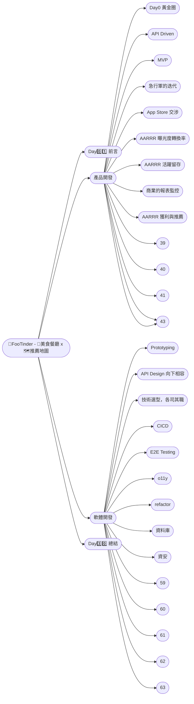

# FooTinder-iThome-2023

# Mindmap

```mermaid
graph LR;
id1(["📱FooTinder - 🥗美食餐廳 x 🗺️推薦地圖"])-->id2(["Day0️⃣1️⃣ 前言"]);
id1(["📱FooTinder - 🥗美食餐廳 x 🗺️推薦地圖"])-->id3(["產品開發"]);
id3(["產品開發"])-->id30(["Day0️ 黃金圈"])
id3(["產品開發"])-->id31(["API Driven"])
id3(["產品開發"])-->id32(["MVP"])
id3(["產品開發"])-->id33(["急行軍的迭代"])
id3(["產品開發"])-->id34(["App Store 交涉"])
id3(["產品開發"])-->id35(["AARRR 曝光度轉換率"])
id3(["產品開發"])-->id36(["AARRR 活躍留存"])
id3(["產品開發"])-->id37(["商業的報表監控"])
id3(["產品開發"])-->id38(["AARRR 獲利與推薦"])
id3(["產品開發"])-->id39(["39"])
id3(["產品開發"])-->id40(["40"])
id3(["產品開發"])-->id41(["41"])
id3(["產品開發"])-->id42(["42"])
id3(["產品開發"])-->id42(["43"])
id1(["📱FooTinder - 🥗美食餐廳 x 🗺️推薦地圖"])-->id5(["軟體開發"]);
id5(["軟體開發"])-->id50(["Prototyping"])
id5(["軟體開發"])-->id51(["API Design 向下相容"])
id5(["軟體開發"])-->id52(["技術選型，各司其職"])
id5(["軟體開發"])-->id53(["CICD"])
id5(["軟體開發"])-->id54(["E2E Testing"])
id5(["軟體開發"])-->id55(["o11y"])
id5(["軟體開發"])-->id56(["refactor"])
id5(["軟體開發"])-->id57(["資料庫"])
id5(["軟體開發"])-->id58(["資安"])
id5(["軟體開發"])-->id59(["59"])
id5(["軟體開發"])-->id60(["60"])
id5(["軟體開發"])-->id61(["61"])
id5(["軟體開發"])-->id62(["62"])
id5(["軟體開發"])-->id63(["63"])
id1(["📱FooTinder - 🥗美食餐廳 x 🗺️推薦地圖"])-->id99(["Day3️⃣0️⃣ 總結"]);
```
