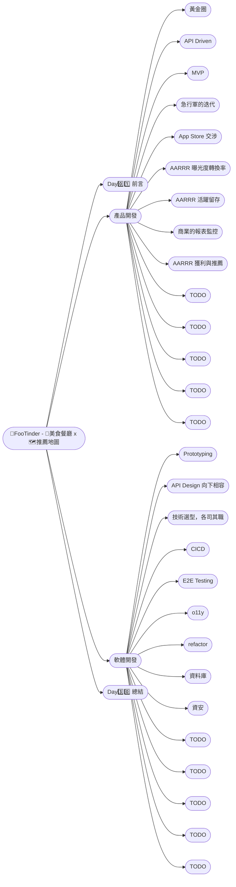

# FooTinder-iThome-2023

# Mindmap

```mermaid
graph LR;
id0(["📱FooTinder - 🥗美食餐廳 x 🗺️推薦地圖"])-->id1(["Day0️⃣1️⃣ 前言"]);
id0(["📱FooTinder - 🥗美食餐廳 x 🗺️推薦地圖"])-->id200(["產品開發"]);
id200(["產品開發"])-->id2(["黃金圈"])
id200(["產品開發"])-->id4(["API Driven"])
id200(["產品開發"])-->id6(["MVP"])
id200(["產品開發"])-->id8(["急行軍的迭代"])
id200(["產品開發"])-->id10(["App Store 交涉"])
id200(["產品開發"])-->id12(["AARRR 曝光度轉換率"])
id200(["產品開發"])-->id14(["AARRR 活躍留存"])
id200(["產品開發"])-->id16(["商業的報表監控"])
id200(["產品開發"])-->id18(["AARRR 獲利與推薦"])
id200(["產品開發"])-->id20(["TODO"])
id200(["產品開發"])-->id22(["TODO"])
id200(["產品開發"])-->id24(["TODO"])
id200(["產品開發"])-->id26(["TODO"])
id200(["產品開發"])-->id28(["TODO"])
id0(["📱FooTinder - 🥗美食餐廳 x 🗺️推薦地圖"])-->id300(["軟體開發"]);
id300(["軟體開發"])-->id3(["Prototyping"])
id300(["軟體開發"])-->id5(["API Design 向下相容"])
id300(["軟體開發"])-->id7(["技術選型，各司其職"])
id300(["軟體開發"])-->id9(["CICD"])
id300(["軟體開發"])-->id11(["E2E Testing"])
id300(["軟體開發"])-->id13(["o11y"])
id300(["軟體開發"])-->id15(["refactor"])
id300(["軟體開發"])-->id17(["資料庫"])
id300(["軟體開發"])-->id19(["資安"])
id300(["軟體開發"])-->id21(["TODO"])
id300(["軟體開發"])-->id23(["TODO"])
id300(["軟體開發"])-->id25(["TODO"])
id300(["軟體開發"])-->id27(["TODO"])
id300(["軟體開發"])-->id29(["TODO"])
id0(["📱FooTinder - 🥗美食餐廳 x 🗺️推薦地圖"])-->id30(["Day3️⃣0️⃣ 總結"]);
```
