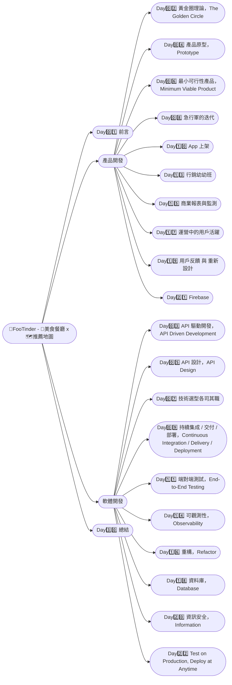

# FooTinder-iThome-2023

# Mindmap

```mermaid
graph LR;
id0(["📱FooTinder - 🥗美食餐廳 x 🗺️推薦地圖"])-->id1(["Day0️⃣1️⃣ 前言"]);
id0(["📱FooTinder - 🥗美食餐廳 x 🗺️推薦地圖"])-->id200(["產品開發"]);
id200(["產品開發"])-->id201(["Day0️⃣2️⃣ 黃金圈理論，The Golden Circle"]);
id200(["產品開發"])-->id202(["Day0️⃣4️⃣ 產品原型，Prototype"]);
id200(["產品開發"])-->id203(["Day0️⃣6️⃣ 最小可行性產品，Minimum Viable Product"]);
id200(["產品開發"])-->id204(["Day0️⃣8️⃣ 急行軍的迭代"]);
id200(["產品開發"])-->id205(["Day1️⃣0️⃣ App 上架"]);
id200(["產品開發"])-->id206(["Day1️⃣3️⃣ 行銷幼幼班"]);
id200(["產品開發"])-->id207(["Day1️⃣5️⃣ 商業報表與監測"]);
id200(["產品開發"])-->id208(["Day1️⃣7️⃣ 運營中的用戶活躍"]);
id200(["產品開發"])-->id209(["Day1️⃣9️⃣ 用戶反饋 與 重新設計"]);
id200(["產品開發"])-->id210(["Day2️⃣1️⃣ Firebase"]);
id0(["📱FooTinder - 🥗美食餐廳 x 🗺️推薦地圖"])-->id300(["軟體開發"]);
id300(["軟體開發"])-->id301(["Day0️⃣3️⃣ API 驅動開發，API Driven Development"]);
id300(["軟體開發"])-->id302(["Day0️⃣5️⃣ API 設計，API Design"]);
id300(["軟體開發"])-->id303(["Day0️⃣7️⃣ 技術選型各司其職"]);
id300(["軟體開發"])-->id304(["Day0️⃣9️⃣ 持續集成 / 交付 / 部署，Continuous Integration / Delivery / Deployment"]);
id300(["軟體開發"])-->id305(["Day1️⃣1️⃣ 端對端測試，End-to-End Testing"]);
id300(["軟體開發"])-->id306(["Day1️⃣4️⃣ 可觀測性，Observability"]);
id300(["軟體開發"])-->id307(["Day1️⃣6️⃣ 重構，Refactor"]);
id300(["軟體開發"])-->id308(["Day1️⃣8️⃣ 資料庫，Database"]);
id300(["軟體開發"])-->id309(["Day2️⃣0️⃣ 資訊安全，Information"]);
id300(["軟體開發"])-->id310(["Day2️⃣2️⃣ Test on Production, Deploy at Anytime"]);
id0(["📱FooTinder - 🥗美食餐廳 x 🗺️推薦地圖"])-->id30(["Day3️⃣0️⃣ 總結"]);
```
