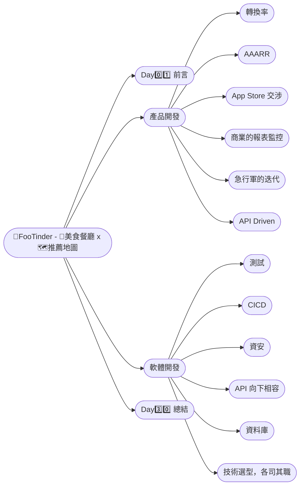

# FooTinder-iThome-2023

# Mindmap

```mermaid
graph LR;
id1(["📱FooTinder - 🥗美食餐廳 x 🗺️推薦地圖"])-->id2(["Day0️⃣1️⃣ 前言"]);
id1(["📱FooTinder - 🥗美食餐廳 x 🗺️推薦地圖"])-->id3(["產品開發"]);
id3(["產品開發"])-->id31(["轉換率"])
id3(["產品開發"])-->id32(["AAARR"])
id3(["產品開發"])-->id33(["App Store 交涉"])
id3(["產品開發"])-->id34(["商業的報表監控"])
id3(["產品開發"])-->id35(["急行軍的迭代"])
id3(["產品開發"])-->id36(["API Driven"])
id1(["📱FooTinder - 🥗美食餐廳 x 🗺️推薦地圖"])-->id4(["軟體開發"]);
id4(["軟體開發"])-->id44(["測試"])
id4(["軟體開發"])-->id45(["CICD"])
id4(["軟體開發"])-->id46(["資安"])
id4(["軟體開發"])-->id47(["API 向下相容"])
id4(["軟體開發"])-->id48(["資料庫"])
id4(["軟體開發"])-->id49(["技術選型，各司其職"])
id1(["📱FooTinder - 🥗美食餐廳 x 🗺️推薦地圖"])-->id99(["Day3️⃣0️⃣ 總結"]);
```
